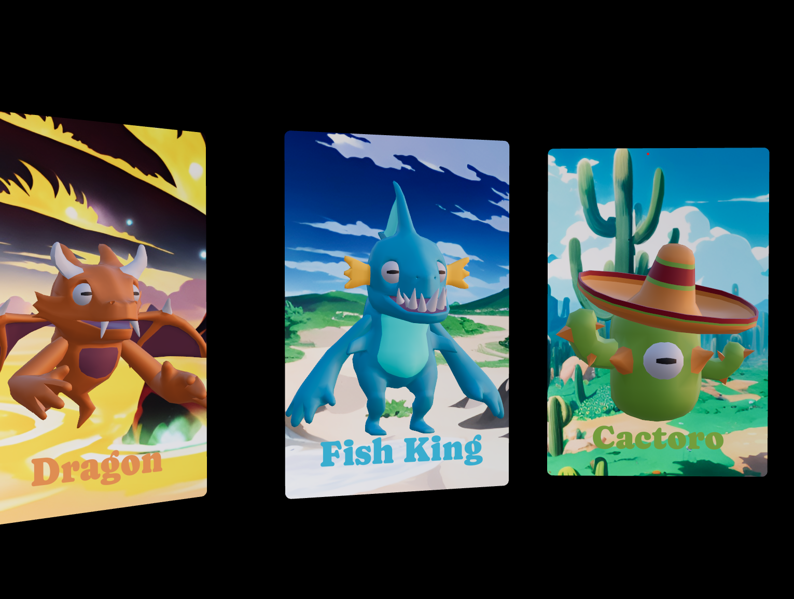

# 🐉 Three Monsters

A colorful and interactive 3D monster showcase built with **React**, **Three.js**, and **React Three Fiber**. Choose between Dragon, Fish King, and Cactoro — each animated, stylized, and living in their own fantasy habitat.

<div align="center">
  
</div>

---

## ✨ Features

- ⚙️ Built with [React Three Fiber](https://github.com/pmndrs/react-three-fiber) for declarative WebGL
- 🎨 Custom animated 3D creatures (Dragon, Fish King, and Cactoro)
- 🌅 Beautiful stylized backgrounds using `MeshPortalMaterial` and `@react-three/drei`
- 🌀 Smooth camera transitions between monsters
- 💫 Responsive hover + click interactions
- 💻 Fully written in **TypeScript**

---

## 🚀 Getting Started

### 1. Clone the repo
```bash
git clone https://github.com/your-username/3d-portals.git
cd three-monsters
